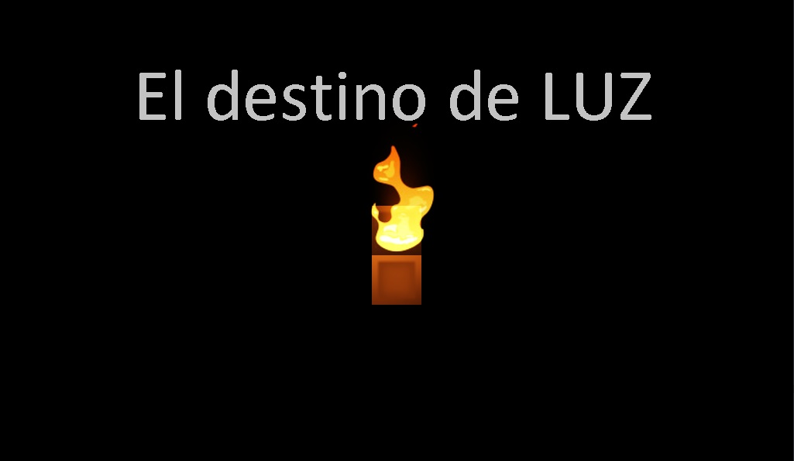

## El Destino de luz

"Despiertas y ves solo oscuridad. Una voz tenue te dice "Sigue el camino de la luz". No tienes forma, solo puedes ver que tu materia es luz. Estas en un lugar extraño, pero no estas solo. Decides hacer caso a esa voz extraña y seguir el camino de la luz. Tienes un temor, el que tu luz se apague, pero no importa lo que pase, siempre vuelves a empezar como si estarias en un loop"

### Visita [itch.io](https://oskit-producciones.itch.io/el-destino-de-luz) para saber mas del juego

### Has click para [Aqui](https://oskit-producciones.github.io/el-destino-de-luz/WebGL) para jugar
